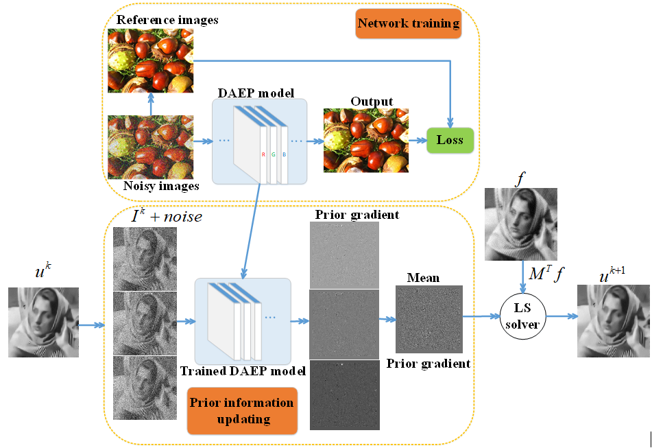
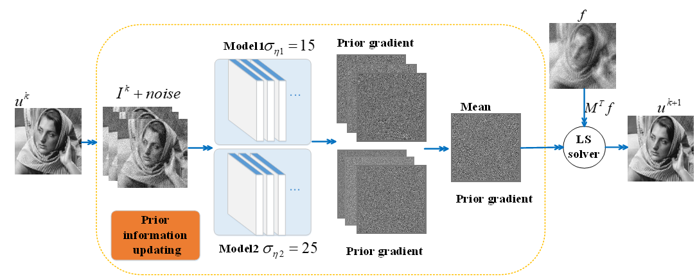
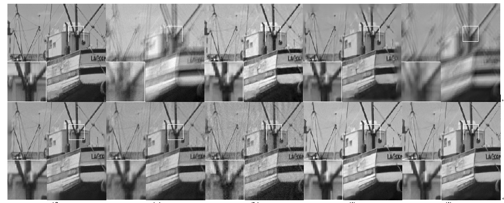

# MEDAEP
Multi-channels and Multi-models based  Autoencoding Priors for Grayscale Image Restoration  
The Code is created based on the method described in the following paper:  
“Multi-channels and multi-models based autoencoding priors for grayscale image restoration”  
Author: Li Sanqian, Liuqiegen, Qinbinjie, Wang. Yuhao, Liang. Dong.  
Date : 12/2018    
Version : 1.0  
The code and the algorithm are for non-comercial use only.  
Copyright 2018, Department of Electronic Information Engineering, Nanchang University.  
Paul C. Lauterbur Research Center for Biomedical Imaging, Shenzhen Institutes of Advanced Technology, Chinese Academy of Sciences,  Shenzhen 518055, China  
Medical AI research center, Shenzhen Institutes of Advanced Technology, Chinese Academy of Sciences, Shenzhen 518055, China  

MEDAEP: Multi-channels and Multi-models based Autoencoding Priors for Grayscale Image Restoration  
## Illustration of EDAEP Network Scheme

## Illustration of MEDAEP Network Scheme

## Visual Quality Comparison of Image Deblurring on Gray Image “Boats”.  
(Gaussian blur kernel size is 25, noisy level is 2.55)

From Top to Bottom and from Left to Right: Ground-truth, blurred image,LevinSps, EPLL, IRCNN, DMSP, DPE, DAEP , EDAEP and MEDAEP.

## [**[Paper]**](https://ieeexplore.ieee.org/stamp/stamp.jsp?tp=&arnumber=8782831)
    @article{li2019multi,
    title={Multi-Channel and Multi-Model-Based Autoencoding Prior for Grayscale Image Restoration},
    author={Li, Sanqian and Qin, Binjie and Xiao, Jing and Liu, Qiegen and Wang, Yuhao and Liang, Dong},
    journal={IEEE Transactions on Image Processing},
    volume={29},
    pages={142--156},
    year={2019},
    publisher={IEEE}
    }

## Other Related Projects
  * Highly Undersampled Magnetic Resonance Imaging Reconstruction using Autoencoding Priors  
[**[Paper]**](https://cardiacmr.hms.harvard.edu/files/cardiacmr/files/liu2019.pdf)  [**[Code]**](https://github.com/yqx7150/EDAEPRec)   [**[Slide]**](https://github.com/yqx7150/EDAEPRec/tree/master/Slide)

  * High-dimensional Embedding Network Derived Prior for Compressive Sensing MRI Reconstruction  
 [**[Paper]**](https://www.sciencedirect.com/science/article/abs/pii/S1361841520300815?via%3Dihub)   [**[Code]**](https://github.com/yqx7150/EDMSPRec)
 
  * Homotopic Gradients of Generative Density Priors for MR Image Reconstruction  
 [**[Code]**](https://github.com/yqx7150/HGGDP)
 
  * Denoising Auto-encoding Priors in Undecimated Wavelet Domain for MR Image Reconstruction  
[**[Paper]**](https://arxiv.org/ftp/arxiv/papers/1909/1909.01108.pdf)  [**[Code]**](https://github.com/yqx7150/WDAEPRec)

  * Learning Priors in High-frequency Domain for Inverse Imaging Reconstruction  
[**[Paper]**](https://arxiv.org/ftp/arxiv/papers/1910/1910.11148.pdf)   [**[Code]**](https://github.com/yqx7150/HFDAEP)
 
  * Learning Multi-Denoising Autoencoding Priors for Image Super-Resolution  
[**[Paper]**](https://www.sciencedirect.com/science/article/pii/S1047320318302700)   [**[Code]**](https://github.com/yqx7150/MDAEP-SR)

  * REDAEP: Robust and Enhanced Denoising Autoencoding Prior for Sparse-View CT Reconstruction  
[**[Paper]**](https://ieeexplore.ieee.org/document/9076295)   [**[Code]**](https://github.com/yqx7150/REDAEP)
